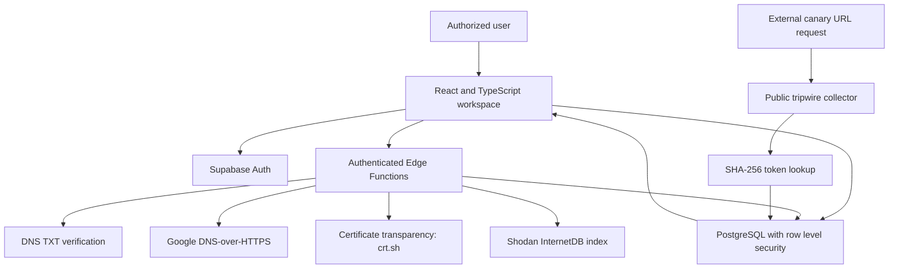

# MirrorTrap architecture

## Security boundaries
1. **Authentication:** Supabase Auth verifies account identity. A UI session is not trusted by the Edge Functions; `verify-domain` and `verified-scan` each authenticate the Bearer token and compare resource ownership.
2. **Domain verification:** User registers a random challenge in the database. The server checks the public DNS TXT record `_mirrortrap-challenge.<domain>`. Only service-side code sets verified_at.
3. **Passive scan:** The scanning function reads authorized verified assets, checks simple rate limits, requests public-source data, and records returned evidence plus provider failures. No exploit payloads are sent.
4. **Canary URL:** 256-bit secret generated in the browser and displayed once. The database only stores a SHA-256 hash. The public endpoint hashes incoming tokens and records requests only for enabled hashes.
5. **Tenant isolation:** Public PostgreSQL tables use RLS on `auth.uid()`. Only service-role functions may insert scan results and request events. The service role is not exposed to the browser.
6. **Reports:** All reported findings are based on actual stored rows. The heuristic exposure index is not a likelihood-of-compromise model.

## Threat model and caveats
- URLs can leak through logs and referrers; treat canary URLs as bearer secrets and distribute carefully. A leaked URL creates signals, but does not identify the visitor as an attacker.
- IP headers can be affected by reverse proxies; timestamps, IPs, and user agents are indicators, not conclusive attribution.
- External public sources can fail, throttle, or return stale observations. Errors are recorded independently from actual evidence.
- The service-role key on Edge Functions is powerful; restrict it to server environment and rotate on exposure.
- Initial ingestion limit is 50 events per token per hour. Production deployments additionally require operational logging, quota enforcement, retention rules and privacy review.
- The project does **not** include active Nmap scanning, network packet capture, exploitation, direct IDS signatures or advanced threat intelligence correlation. Do not claim those functions during an academic defense.
